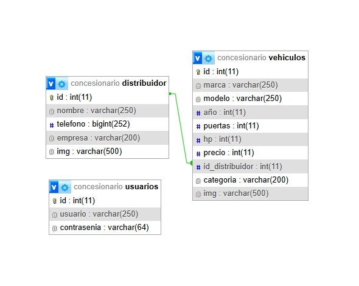

## Integrantes

- Marcos David Tami
- Luca Bossio

## Proyecto

Nuestra pagina esta destinada a una empresa dedicada a vender autos a un precio asequible ya que cuenta con los distribuidores oficiales de las distintas fabricas de vehiculos.
Los usuarios podran navegar, buscar su mejor opcion y encargarlo directo desde la web.

## Acceso

Para acceder a la pagina web, se debe inicar el servidor web de XAMPP y acceder a la direccion http://localhost/concesionaria_TPE/
La base de datos se instala automaticamente en MySQL. De no ser así, se debe instalar el archivo que se encuentra en la carpeta "db" dentro de la carpeta de la pagina web.

### Pasos para instalar la base de datos (manual)

1. iniciar el servidor web de XAMPP (MySQL y apache).
2. Apretar el boton "Admin" el cual los redireccionará a la pagina de administracion de MySQL.
3. Crear una nueva base de datos con el nombre "concesionaria_marcosyluca".
4. Dentro de la base de datos creada, apretar en "importar" y una vez dentro, cargar el archivo "concesionaria_marcosyluca.sql" en la ubicacion anteriormente mencionada.
5. Una vez cargado, el usuario puede acceder a la pagina web.

### Contraseñas

El usuario por defecto puede visualizar tanto las listas de vehiculos, como de los distribuidores. Para acceder a la administracion de la pagina, se debe utilizar el usuario "webadmin" con la contraseña "admin". Una vez iniciado sesion, podra eliminar, agregar o editar tanto los vehiculos como los distribuidores.

## Diagrama de la base de datos

